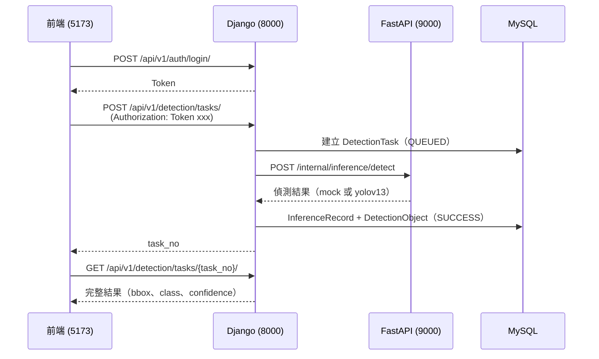

# YOLOv13 RainFog Detection Admin

雨霧天氣場景下車輛與行人的物體識別後台管理系統，採三服務分層架構。

## 服務一覽

| 服務 | 埠號 | 技術棧 | 職責 |
|------|------|--------|------|
| 業務後端 | 8000 | Django 5 + DRF + MySQL | Token 認證、任務管理、結果入庫、審計統計 |
| 推理服務 | 9000 | FastAPI + pydantic-settings | 推理封裝（mock / yolov13 可切換） |
| 管理前端 | 5173 | React 19 + Vite + Tailwind | 登入、任務提交、結果展示、系統配置 |

## 系統請求流程



## 快速啟動（macOS）

### 1. 環境準備

```bash
cp backend/.env.example backend/.env
# 編輯 .env，填入 MYSQL_PASSWORD 與 DJANGO_SECRET_KEY
```

### 2. 啟動基礎設施（MySQL + Redis）

```bash
./scripts/macos/docker_up.sh
./scripts/macos/init_mysql.sh   # 首次執行
```

### 3. 安裝依賴與啟動全部服務

```bash
./scripts/macos/install_all.sh
./scripts/macos/start_all.sh    # Django + FastAPI + React
```

### 4. 建立管理員帳號（首次執行）

```bash
./scripts/macos/create_admin.sh
```

### 5. 驗證服務

```bash
curl http://127.0.0.1:8000/health/
curl http://127.0.0.1:9000/internal/health
# 前端：http://localhost:5173
```

## 個別服務管理

```bash
./scripts/macos/start_backend.sh    # Django only (port 8000)
./scripts/macos/start_inference.sh  # FastAPI only (port 9000)
./scripts/macos/start_frontend.sh   # React only  (port 5173)
./scripts/macos/stop_all.sh
```

## 推理模式

**預設為 Mock 模式，不需任何模型檔即可完整運行。**

| 模式 | 環境變數 | 需求 |
|------|----------|------|
| Mock（預設） | `INFERENCE_MODEL_MODE=mock` | 無需模型檔 |
| 真實 YOLOv13（可選） | `INFERENCE_MODEL_MODE=yolov13` | 見下方步驟 |

### 啟用真實 YOLOv13（可選）

```bash
# 1. 安裝 ultralytics 依賴
cd backend && uv sync --extra yolo

# 2. Clone yolov13 原始碼至專案根目錄
git clone https://github.com/iMoonLab/yolov13 yolov13-main

# 3. 下載模型權重至 data/models/（https://github.com/iMoonLab/yolov13/releases）
#    規格：yolov13n.pt（最快）/ yolov13s / yolov13l / yolov13x（最準）

# 4. 更新 backend/.env
INFERENCE_MODEL_MODE=yolov13
INFERENCE_USE_MOCK=False

# 5. 重啟推理服務
./scripts/macos/stop_inference.sh
./scripts/macos/start_inference.sh
```

## 目錄結構

```
.
├── backend/
│   ├── apps/
│   │   ├── accounts/       # Token 認證與使用者
│   │   ├── detection/      # 任務管理、結果入庫（DetectionTask / InferenceRecord / DetectionObject）
│   │   ├── media/          # 圖片上傳管理
│   │   ├── audit/          # 操作審計日誌
│   │   ├── dashboard/      # 統計儀表盤（Redis 快取）
│   │   └── system/         # 系統配置中心
│   ├── inference_service/
│   │   ├── adapters/       # mock.py / yolov13.py（可擴充）
│   │   ├── core/config.py  # 所有 INFERENCE_* 環境變數
│   │   └── api/routes.py   # /internal/health、/models/current、/inference/detect
│   └── config/             # Django settings
├── frontend/src/
│   ├── pages/              # login / dashboard / detection / system / audit
│   ├── stores/auth-store.ts
│   └── services/api.ts
├── data/
│   ├── models/             # YOLOv13 權重（.pt，可選，本地自行準備）
│   ├── uploads/            # 上傳圖片
│   └── results/            # 推理結果標注圖
├── docs/                   # 系統設計文檔
└── scripts/macos/          # 啟停腳本
```

## 關鍵環境變數

完整範本見 `backend/.env.example`。

| 變數 | 預設值 | 說明 |
|------|--------|------|
| `DJANGO_SECRET_KEY` | — | 必填，生產環境需隨機 50 字元 |
| `INFERENCE_MODEL_MODE` | `mock` | `mock` 或 `yolov13` |
| `INFERENCE_USE_MOCK` | `True` | Django 端 fallback 開關 |
| `INFERENCE_MODELS_ROOT` | `data/models/` | .pt 權重存放目錄 |
| `INFERENCE_YOLOV13_MODEL_FILE` | `yolov13n.pt` | 預設載入的模型規格 |
| `INFERENCE_LOG_LEVEL` | `INFO` | 推理服務日誌等級 |

## 前端頁面

| 路由 | 功能 |
|------|------|
| `/login` | Token 認證登入 |
| `/dashboard` | 任務量統計、識別趨勢 |
| `/detection` | 建立任務、查詢歷史 |
| `/detection/:taskNo` | 偵測結果詳情（bbox、類別、信心度） |
| `/system` | 系統參數配置 |
| `/audit` | 操作日誌查詢 |

## 實作進度

| Phase | 目標 | 狀態 |
|-------|------|------|
| Phase 0 | 系統設計文檔、API 草案 | 完成 |
| Phase 1 | 三服務骨架、MySQL / Redis 基礎配置 | 完成 |
| Phase 2 | Token 認證、圖片上傳、任務 CRUD、Mock 推理、結果展示 | 完成 |
| Phase 3 | 儀表盤統計、系統配置中心、操作審計、Redis 快取 | 完成 |
| Phase 4 | 真實 YOLOv13 推理（Adapter 已實作，掛載模型即啟用） | 程式碼就緒 |
| Phase 5 | Celery 非同步任務、容器化部署 | 規劃中 |
