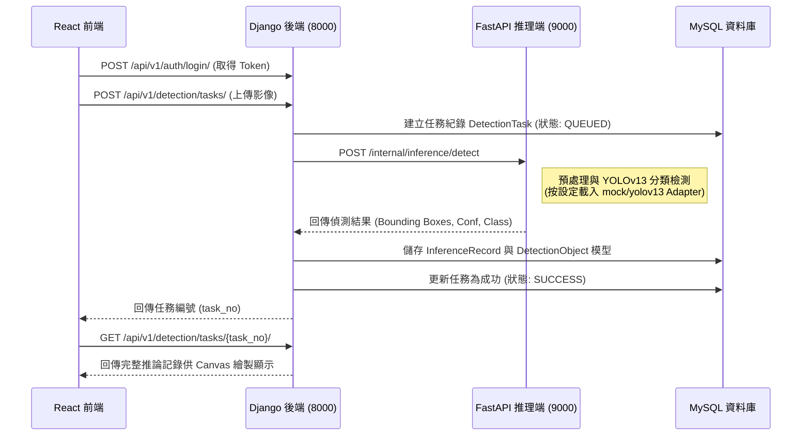

# YOLOv13 雨霧天氣目標檢測平台 (YOLOv13 RainFog Detection)

## 目錄 (Table of Contents)
- [專案概述](#專案概述)
- [系統架構與資料流](#系統架構與資料流)
- [前後端與模組說明](#前後端與模組說明)
- [模型訓練與推理流程](#模型訓練與推理流程)
- [評估指標 (數學說明)](#評估指標-數學說明)
- [執行與開發指引](#執行與開發指引)

---

## 專案概述

本專案為「**YOLOv13 雨霧天氣目標檢測**」全端系統，專為處理低能見度（雨雪、濃霧）惡劣氣象場景下的車輛與行人識別而設計。系統採三服務分層架構，確保業務邏輯、運算密集型推理任務與前端展示的有效解耦。

### 核心服務角色
1. **Django 後端 (8000)**：核心控制中樞。處理複雜的業務邏輯、使用者的推理任務管理配置、模型結果資料的持久化以供後續操作 (儲存於 MySQL)，並控管後台登入的 Token 驗證機制。
2. **FastAPI 推理服務 (9000)**：專注於深度學習演算法處理。接收後端傳來的影像路徑以提供獨立的 AI 推理能力（支援 Mock 及 YOLOv13 的靈活切換）。
3. **React 前端 (5173)**：提供管理員登入後台、動態數據儀表盤系統、影像上傳來建立任務，直接視覺化含有物體標註框 (Bounding Box) 的模型辨識結果。

---

## 系統架構與資料流

以下呈現系統架構與從任務上傳到推理完成的核心完整資料流：



---

## 前後端與模組說明

### Frontend 管理前端
* **主要頁面 (/pages)**：`/login` (登入), `/dashboard` (任務統計/辨識趨勢), `/detection` (影像上傳與列表查詢), `/detection/:taskNo` (辨識明細), `/system` (系統配置), `/audit` (審計日誌)。
* **路由保護**：非公開 API 需依賴 Token，所有受保護頁面透過核心 Router 機制與高層級保護攔截，未授權將強制登出重定向。
* **狀態管理**：使用 `Zustand` (`auth-store.ts`) 進行全域共享狀態管理，負責存放當前使用者與 JWT Token。
* **API 呼叫封裝**：於 `services/` 目錄統一封裝 Axios 請求與錯誤處置，所有需要認證的接口會自動夾帶中繼 `Authorization` Token 標頭。

### Backend 業務後端 (Django)
利用 Django App 將核心業務高內聚為多層級應用：
* `accounts`：處理登入與 Auth Token 認證，定義使用者資源管理。
* `detection`：系統生命週期的核心邏輯層，主要負責任務任務非同步儲備 (`DetectionTask`) 及儲存來自推理端的框列表及置信度 (`InferenceRecord`, `DetectionObject`)。
* `media`：媒體服務與儲存模組，處理圖片或錄像靜態資源上傳。
* `dashboard`：彙整 Redis 緩存數據產生業務層級統計報表輸出。
* `audit`：全域與自訂操作審查日誌，供資料稽核使用。
* `system`：維護多組系統靜態配置並保證可擴展中心化管理。

### Inference 推理服務 (FastAPI)
* **API 端點設計**：輕量級定義包括 `/internal/health` (服務健康探活), `/internal/models/current` (查看目前推斷服務調用模型), 以及核心驅動入口 `/internal/inference/detect`。
* **Adapter 轉接層與切換機制**：核心推理封裝於 `adapters/base.py` 進行高度抽象，實作兩個具體提供器 `mock.py` 與 `yolov13.py`。
* 當前啟動時，若未準備模型可透過改變環境變數 `INFERENCE_MODEL_MODE=mock` 以假資料無縫聯調；待硬體資源就緒透過切換為 `yolov13` 動態呼喚對應處理模組。

---

## 模型訓練與推理流程

系統的 AI 視覺檢測建構於 YOLO 系列優化算法，流程拆分為兩個生命週期：

### 1. 訓練流程 (需離線執行 / 本專案未內建)
負責將雨霧天氣的龐大標註數據訓練為可用推論字典（權重檔）：
* **資料準備**：收集並整理含弱光、雨滴、霧氣的公路或路口影像，並依循標準 YOLO 標註格式定義真實標註框 (Ground Truth)。
* **模型訓練**：透過 Ultralytics 框架，基於超參數對於 YOLOv13 特徵提取層進行訓練迭代。
* **權重配置**：成功完成擬合後將輸出 `.pt` 儲存格式檔案（例如:預設 `yolov13n.pt` 輕量模組）。此生成的檔案必須被放置於專案空間的 `data/models/` 目錄之下，供推理服務掛載。

### 2. 推理流程 (FastAPI 端實作 / 階段 4)
負責後台提交後的高併發運算檢測分析：
* **預處理**：請求到達 `fastapi/adapter` 時，系統先讀取指定儲存影像將其解碼，把不同長寬比例相片調整(Resize & Padding)縮放至 YOLO 規定相容像素張量(Tensor) 並執行正規化。
* **推理處理**：預處理後的 NumPy 矩陣載入 YOLOv13 神經網路內執行前向計算 (Forward pass)，提取深層特徵。
* **後處理與回傳**：推理處理輸出結果為龐大幾何預測錨框，接著透過 **NMS (非極大值抑制)** 方法刪除大量重疊信心度較低的邊界框，篩選出單一標的物，最後轉換包含座標 `[x,y,w,h]` 與 `class_name`、`confidence` 等完整 JSON 再回傳至 Django。

---

## 評估指標 (數學說明)

用於評量本系統底層 AI (YOLO) 在雨霧場景標出預測物之常見核心量化目標：

### 1. 交併比 (Intersection over Union, IoU)
用於衡量「模型預測產生的邊界框」 ($B_p$) 與「實際人工標註真實邊界框」 ($B_{gt}$) 之面積重疊精準程度。

$$
\text{IoU} = \frac{\text{Area}(B_p \cap B_{gt})}{\text{Area}(B_p \cup B_{gt})}
$$

### 2. 平均精確率均值 (Mean Average Precision, mAP)
為物件層級檢測極為關鍵的評估值。<br/>
首先藉由 True Positive (TP) 定義精確率與召回率：
$$
\text{Precision} = \frac{TP}{TP + FP}, \quad \text{Recall} = \frac{TP}{TP + FN}
$$
對於所有 $N$ 個分類，求出 Precision-Recall 曲線下的面積即為 Average Precision (AP)，之後取所有類別均值。
$$
\text{mAP} = \frac{1}{N} \sum_{i=1}^{N} \text{AP}_i
$$

---

## 執行與開發指引

### 關鍵環境變數設定
專注於推理服務的通訊開關，請於專案目錄透過 `cp backend/.env.example backend/.env` 建立並確認以下配置：

```env
# 控制 Django 呼叫 FastAPI 之網址
INFERENCE_BASE_URL=http://localhost:9000

# 模型與推理控制策略
INFERENCE_MODEL_MODE=mock      # 開發期可維持 'mock'，預備載入真實模型則改為 'yolov13'
INFERENCE_USE_MOCK=true        # 在後端 fallback 保護容錯功能

# 模型權重檔案讀取路徑
INFERENCE_YOLOV13_MODEL_FILE=yolov13n.pt
INFERENCE_MODELS_ROOT=../data/models
```

### 本機啟動步驟 (開發指引)
專案建議分離啟動（若直接採用腳本請參照 `/scripts` 目錄）。以下為通用依賴啟動邏輯：

```bash
# 1. 啟動基礎容器服務 (MySQL + Redis，必須裝有 Docker)
docker compose -f docker-compose.dev.yml up -d

# 2. 初始化後端資料結構 (只須在全新啟動時執行)
cd backend
uv sync
uv run python manage.py migrate
uv run python manage.py createsuperuser # 用戶名可任意設立管理員

# 3. 啟動核心 Django 業務端 (Terminal 1)
cd backend
uv run python manage.py runserver 0.0.0.0:8000

# 4. 啟動 FastAPI 推理端 (Terminal 2)
cd backend
uv run uvicorn inference_service.main:app --reload --host 0.0.0.0 --port 9000

# 5. 啟動前端開發伺服器 (Terminal 3)
cd frontend
npm install
npm run dev
# 啟動後存取位址：http://localhost:5173
```

### 測試指令與格式 Lint
在發布拉取請求前，請務必跑過以下工程管控指令，確認維持高品質程式碼：

```bash
# -- 後端品質測試區塊 (Backend) --
cd backend

# 執行所有測試並查看通過率
uv run pytest

# 特定測試快速複查
uv run pytest tests/path/test_file.py -k "test_name"

# 利用 Ruff 執行變數靜態檢查或修正排版 (請維持無錯誤 Zero warning)
uv run ruff check .
uv run ruff format .
```
