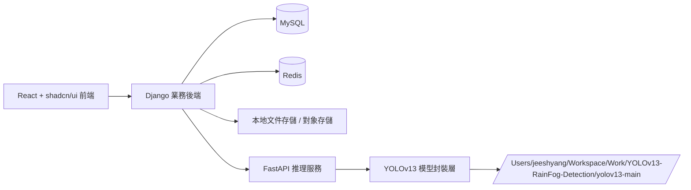
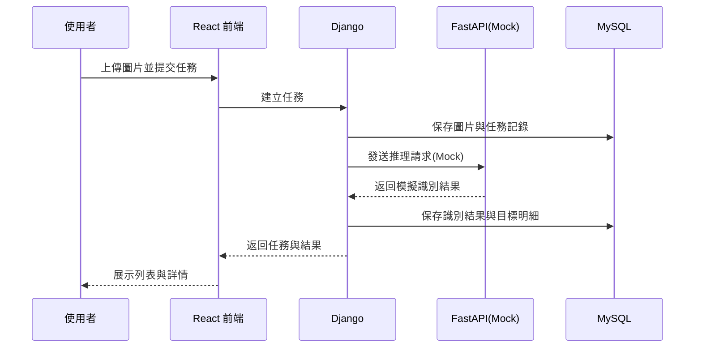
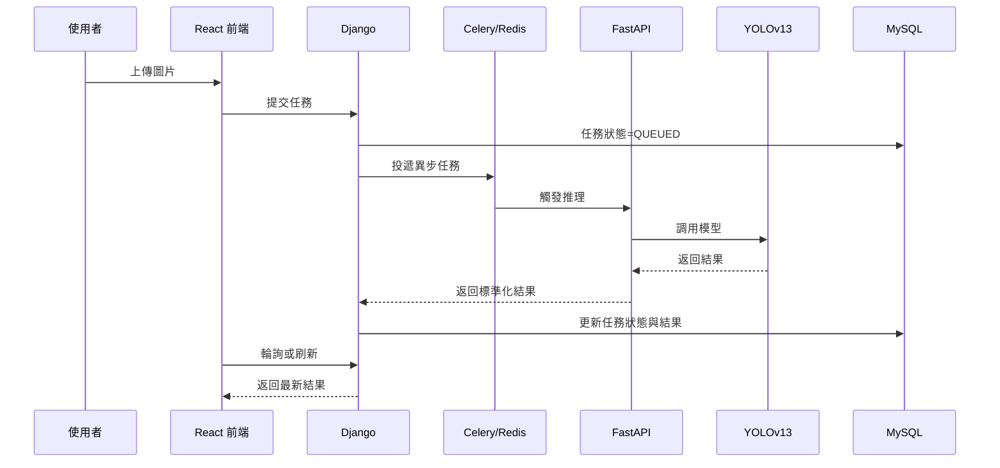
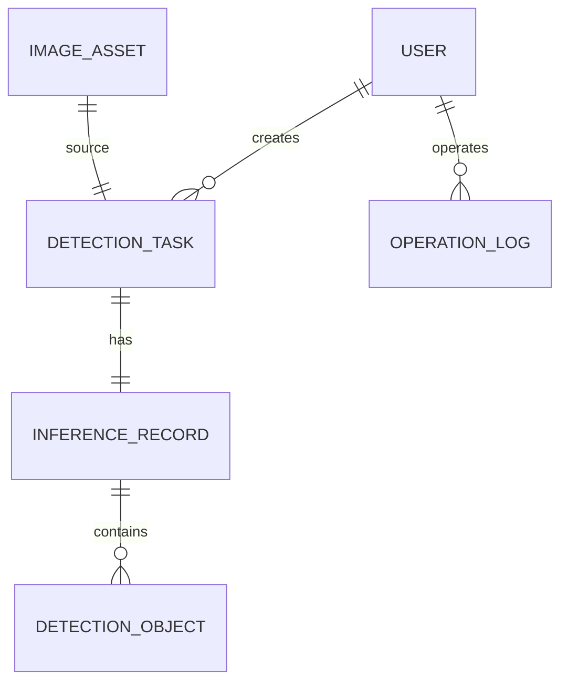
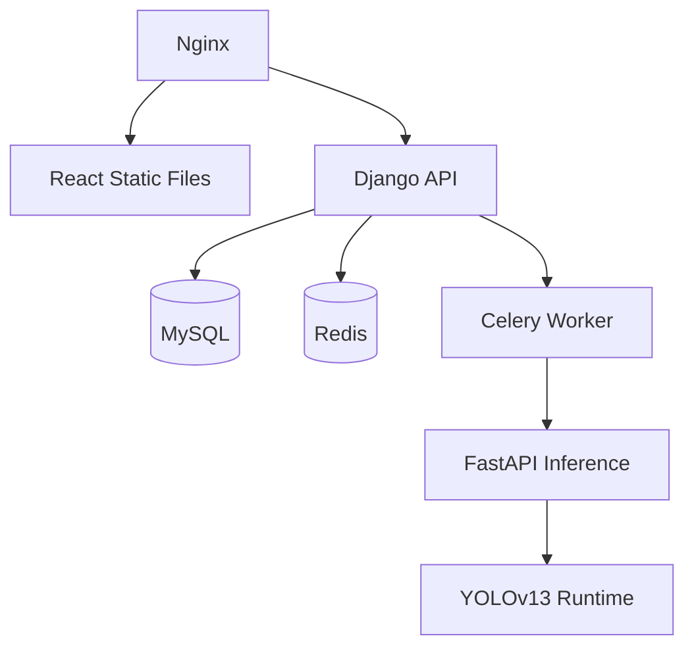

# YOLOv13 雨霧天氣物體識別後台管理系統整體設計文檔

## 1. 文檔目的

本文檔用於定義基於 YOLOv13 的雨霧天氣物體識別後台管理系統的整體方案。在目前資料集與模型環境尚未準備完成之前，先完成 Web 系統架構、數據結構、模組職責與接口契約設計，為後續逐步實現提供清晰藍圖。

當前階段明確約束如下：

- 暫不執行 YOLOv13 真實模型推理。
- 暫不進行資料集訓練、權重管理與模型效果驗證。
- 先完成管理系統與推理服務的解耦式設計。
- 先以 Mock 推理與接口契約方式打通系統骨架。

---

## 2. 項目目標

構建一套面向雨霧天氣場景的物體識別後台管理系統，滿足以下核心能力：

1. 用戶可上傳待識別圖片。
2. 系統可調用 YOLOv13 雨霧天氣物體識別能力完成推理。
3. 系統保存識別結果、識別記錄與操作審計信息。
4. 提供後台管理、查詢、統計與展示能力。
5. 後續可無痛切換為真實 YOLOv13 推理。

---

## 3. 技術棧與角色定位

### 3.1 技術棧

- 前端：React + TypeScript + Vite + shadcn/ui
- 業務後端：Django + Django REST Framework
- 推理服務：FastAPI
- 資料庫：MySQL 8.x
- 快取與性能優化：Redis
- 異步任務建議：Celery + Redis
- 文件存儲：
  - 開發期：本地文件系統
  - 生產期：可擴展至 MinIO / OSS / S3

### 3.2 技術角色分工

#### Django

負責管理域與業務域能力：

- 用戶、角色、權限
- 圖片上傳管理
- 任務創建與狀態流轉
- 識別結果入庫
- 查詢、統計、審計、配置管理
- 對前端提供統一業務 API

#### FastAPI

負責算法域能力：

- 封裝推理服務接口
- 隔離 YOLOv13 模型運行細節
- 後續承接模型載入、推理、結果轉換
- 當前階段先以 Mock 響應或契約接口形式存在

#### React + shadcn/ui

負責展示與交互：

- 登錄與權限入口
- 圖片上傳與任務提交
- 識別結果列表、詳情、統計頁
- 系統配置與操作管理界面

---

## 4. 設計原則

### 4.1 高內聚低耦合

- Django 專注於後台業務管理與資料持久化。
- FastAPI 專注於推理能力封裝，不關心後台頁面與權限管理。
- 前端只依賴業務 API，不直接依賴推理服務。

### 4.2 契約先行

即使目前不執行真實 YOLO 模型，也先定義好推理請求與回應契約，避免後續模型環境就緒後大範圍改接口。

### 4.3 漸進式演進

- 第一階段先打通管理流程與資料流。
- 第二階段引入異步任務與 Redis 快取。
- 第三階段接入真實 YOLOv13 推理。
- 第四階段做性能、可靠性與多節點擴展。

### 4.4 前後端分層清晰

- 展示層：React
- 應用層：Django API / FastAPI API
- 領域層：任務、結果、審計、配置
- 基礎設施層：MySQL、Redis、文件存儲、模型服務

---

## 5. 系統邊界

### 5.1 本期範圍

- 後台管理系統整體架構設計
- 圖片上傳流程設計
- 任務與結果數據模型設計
- 查詢、列表、詳情、統計頁設計
- Django 與 FastAPI 解耦方案設計
- 接口契約設計
- 快取、部署、安全、審計設計

### 5.2 暫不實施範圍

- YOLOv13 真實模型推理
- 模型訓練與權重管理平台
- 視頻流檢測與即時串流分析
- 大規模分散式推理集群
- 自動標註與主動學習平台

---

## 6. 業務角色與核心場景

### 6.1 系統角色

1. 超級管理員
   負責系統配置、用戶管理、角色權限、服務監控。

2. 業務管理員
   負責圖片上傳、任務查詢、結果審核、統計查看。

3. 普通操作員
   負責提交識別任務與查看自己有權限訪問的識別結果。

### 6.2 核心業務場景

1. 圖片上傳後建立識別任務。
2. 系統調用推理服務獲取識別結果。
3. 識別結果入庫並生成檢測目標明細。
4. 管理員在後台查看任務列表與識別詳情。
5. 基於時間、狀態、類別、置信度等條件查詢結果。
6. 對系統操作與推理調用進行審計留痕。

---

## 7. 總體架構設計

### 7.1 邏輯架構圖



### 7.2 推薦交互原則

- 前端僅調用 Django API。
- Django 作為統一業務入口，負責認證、授權、資料保存與流程協調。
- Django 透過內部 HTTP 或消息隊列調用 FastAPI。
- FastAPI 不直接暴露給前端。

### 7.3 為什麼這樣拆分

這種拆分方式能確保：

- 業務邏輯與算法邏輯隔離。
- 模型服務可獨立升級、替換或擴容。
- 前端無需感知 YOLOv13 的路徑、權重、輸入輸出細節。
- 即使未接入真實模型，也可先以 Mock 返回完成整體管理系統建設。

---

## 8. 核心模組設計

### 8.1 前端模組

#### 1. 認證與權限模組

- 登錄頁
- 當前用戶資訊
- 路由守衛
- 菜單權限控制

#### 2. 任務管理模組

- 圖片上傳頁
- 任務建立與提交
- 任務列表
- 任務詳情
- 任務狀態篩選

#### 3. 結果展示模組

- 原圖展示
- 檢測框疊加預覽
- 檢測目標列表
- 置信度與類別統計

#### 4. 系統管理模組

- 用戶管理
- 角色權限
- 系統配置
- 操作日誌

#### 5. 儀表盤模組

- 任務總量
- 今日識別數
- 失敗任務數
- 類別分佈統計
- 最近識別趨勢

### 8.2 Django 後端模組

#### 1. `apps/accounts`

- 用戶管理
- 角色權限
- 登錄認證
- Token / Session 管理

#### 2. `apps/media`

- 圖片上傳
- 文件元數據管理
- 訪問路徑生成
- 圖片校驗與去重策略

#### 3. `apps/detection`

- 識別任務管理
- 任務狀態流轉
- 推理結果入庫
- 檢測目標明細存儲

#### 4. `apps/dashboard`

- 統計指標
- 匯總查詢
- 首頁儀表盤數據接口

#### 5. `apps/audit`

- 操作日誌
- API 請求審計
- 異常記錄

#### 6. `apps/system`

- 系統配置
- 推理服務開關
- 模型版本配置
- 置信度閾值等參數配置

#### 7. `common`

- 基礎返回格式
- 異常處理
- 分頁器
- 工具函數
- 常量與枚舉

#### 8. `integrations/inference`

- FastAPI 客戶端
- 請求封裝
- 超時與重試
- Mock 推理適配器
- 真實 YOLO 適配器接口

### 8.3 FastAPI 模組

#### 1. `api`

- 推理請求入口
- 健康檢查
- 模型資訊接口

#### 2. `schemas`

- 推理請求模型
- 推理回應模型

#### 3. `services`

- 推理流程服務
- 結果標準化服務

#### 4. `adapters`

- MockAdapter
- YoloV13Adapter

#### 5. `core`

- 配置
- 日誌
- 異常處理

當前階段只實現 `MockAdapter` 即可，`YoloV13Adapter` 保留接口與實現占位。

---

## 9. 核心業務流程

### 9.1 當前階段流程



### 9.2 未來真實推理流程



### 9.3 任務狀態設計

- `PENDING`：已建立，待提交
- `QUEUED`：已入隊，等待推理
- `PROCESSING`：推理中
- `SUCCESS`：推理成功
- `FAILED`：推理失敗
- `CANCELED`：任務取消

---

## 10. 數據模型設計

### 10.1 實體關係概述



### 10.2 核心數據表

#### 1. `users`

建議直接基於 Django `auth_user` 擴展，保存：

- 用戶名
- 密碼摘要
- 郵箱
- 狀態
- 最後登錄時間
- 建立時間

#### 2. `user_profile`

擴展欄位：

- `id`
- `user_id`
- `display_name`
- `phone`
- `avatar`
- `department`
- `created_at`
- `updated_at`

#### 3. `roles`

- `id`
- `name`
- `code`
- `description`
- `created_at`

#### 4. `image_assets`

保存原始圖片元數據：

- `id`
- `file_name`
- `original_name`
- `file_path`
- `file_url`
- `file_size`
- `file_ext`
- `width`
- `height`
- `sha256`
- `storage_type`
- `uploaded_by`
- `created_at`

#### 5. `detection_tasks`

任務主表：

- `id`
- `task_no`
- `image_id`
- `status`
- `trigger_mode`
- `source_type`
- `weather_scene`
- `confidence_threshold`
- `iou_threshold`
- `requested_by`
- `started_at`
- `finished_at`
- `error_message`
- `created_at`
- `updated_at`

說明：

- `trigger_mode`：manual / batch / api
- `source_type`：image_upload / historical_replay
- `weather_scene`：rain / fog / rain_fog / unknown

#### 6. `inference_records`

一次推理請求的實際執行記錄：

- `id`
- `task_id`
- `engine_type`
- `engine_version`
- `model_name`
- `model_version`
- `request_payload`
- `response_payload`
- `result_image_path`
- `result_image_url`
- `object_count`
- `avg_confidence`
- `duration_ms`
- `is_mock`
- `created_at`

#### 7. `detection_objects`

檢測目標明細：

- `id`
- `record_id`
- `class_name`
- `class_id`
- `confidence`
- `bbox_x1`
- `bbox_y1`
- `bbox_x2`
- `bbox_y2`
- `bbox_width`
- `bbox_height`
- `area_ratio`
- `created_at`

#### 8. `operation_logs`

- `id`
- `user_id`
- `module`
- `action`
- `method`
- `path`
- `ip`
- `request_body`
- `response_code`
- `status`
- `created_at`

#### 9. `system_configs`

- `id`
- `config_key`
- `config_value`
- `value_type`
- `description`
- `updated_by`
- `updated_at`

### 10.3 索引建議

- `detection_tasks.task_no`
- `detection_tasks.status`
- `detection_tasks.created_at`
- `detection_tasks.requested_by`
- `inference_records.task_id`
- `detection_objects.record_id`
- `detection_objects.class_name`
- `image_assets.sha256`
- `operation_logs.user_id`
- `operation_logs.created_at`

---

## 11. API 設計

### 11.1 API 分層原則

- 對前端暴露：Django REST API
- 對內部服務暴露：FastAPI 推理 API
- 返回格式統一
- 錯誤碼統一
- 支持分頁、排序、條件篩選

### 11.2 Django API 規劃

#### 認證模組

- `POST /api/v1/auth/login`
- `POST /api/v1/auth/logout`
- `GET /api/v1/auth/me`

#### 用戶與權限

- `GET /api/v1/users`
- `POST /api/v1/users`
- `PUT /api/v1/users/{id}`
- `GET /api/v1/roles`

#### 圖片管理

- `POST /api/v1/images/upload`
- `GET /api/v1/images`
- `GET /api/v1/images/{id}`

#### 識別任務

- `POST /api/v1/detection/tasks`
- `GET /api/v1/detection/tasks`
- `GET /api/v1/detection/tasks/{id}`
- `POST /api/v1/detection/tasks/{id}/retry`
- `POST /api/v1/detection/tasks/{id}/cancel`

#### 識別結果

- `GET /api/v1/detection/results`
- `GET /api/v1/detection/results/{taskId}`
- `GET /api/v1/detection/objects`

#### 儀表盤

- `GET /api/v1/dashboard/overview`
- `GET /api/v1/dashboard/trends`
- `GET /api/v1/dashboard/class-distribution`

#### 系統配置與日誌

- `GET /api/v1/system/configs`
- `PUT /api/v1/system/configs/{id}`
- `GET /api/v1/audit/logs`

### 11.3 FastAPI 內部接口規劃

#### 健康檢查

- `GET /internal/health`

#### 模型資訊

- `GET /internal/models/current`

#### 推理請求

- `POST /internal/inference/detect`

請求示例：

```json
{
  "task_no": "DT202603270001",
  "image_path": "/data/uploads/2026/03/27/demo.jpg",
  "confidence_threshold": 0.25,
  "iou_threshold": 0.45,
  "scene": "rain_fog",
  "mock": true
}
```

回應示例：

```json
{
  "task_no": "DT202603270001",
  "success": true,
  "engine_type": "fastapi-mock",
  "engine_version": "0.1.0",
  "model_name": "yolov13-rainfog",
  "model_version": "draft",
  "duration_ms": 126,
  "result_image_path": "/data/results/2026/03/27/demo_result.jpg",
  "objects": [
    {
      "class_id": 0,
      "class_name": "car",
      "confidence": 0.92,
      "bbox": [120, 80, 360, 240]
    }
  ],
  "raw": {
    "mock": true
  }
}
```

### 11.4 統一返回格式建議

```json
{
  "code": 0,
  "message": "success",
  "data": {},
  "request_id": "req_xxx"
}
```

---

## 12. 前端架構設計

### 12.1 目錄規劃建議

```text
frontend/
  src/
    app/
    components/
    features/
      auth/
      dashboard/
      detection/
      images/
      system/
    hooks/
    layouts/
    lib/
    pages/
    router/
    services/
    stores/
    types/
    utils/
```

### 12.2 頁面規劃

1. 登錄頁
2. 首頁儀表盤
3. 圖片上傳頁
4. 任務列表頁
5. 任務詳情頁
6. 結果查詢頁
7. 用戶管理頁
8. 角色權限頁
9. 系統配置頁
10. 操作日誌頁

### 12.3 組件分層

- 通用組件：表格、分頁、查詢條件欄、圖片預覽、狀態標籤
- 業務組件：任務創建表單、識別結果面板、檢測框畫布、統計卡片
- 頁面容器：負責拉取數據與狀態組裝

### 12.4 狀態管理建議

- 服務端狀態：TanStack Query
- 全局 UI 狀態：Zustand
- 表單管理：React Hook Form + Zod

### 12.5 前端交互原則

- 查詢條件、表格、詳情彈窗高度組件化
- 狀態標識可視化，例如 `SUCCESS`、`FAILED`、`PROCESSING`
- 圖片詳情頁支持原圖與識別結果圖切換
- 所有敏感操作提供二次確認

---

## 13. Django 後端架構設計

### 13.1 分層建議

- `models`：數據結構
- `repositories`：數據查詢封裝
- `services`：業務編排
- `serializers`：輸入輸出驗證
- `views`：API 入口
- `tasks`：異步任務
- `clients`：外部服務調用

### 13.2 典型調用鏈

`View -> Serializer -> Service -> Repository / Client`

這樣的分層能夠避免：

- View 中堆積業務邏輯
- 模型直接感知外部服務
- 推理調用與資料處理強耦合

### 13.3 關鍵服務設計

#### `UploadService`

- 檢查文件格式與大小
- 計算摘要
- 保存文件元數據

#### `DetectionTaskService`

- 建立任務
- 更新狀態
- 觸發推理
- 失敗重試

#### `InferenceDispatchService`

- 調用 FastAPI
- 控制超時與重試
- 切換 Mock / Real Adapter

#### `DetectionResultService`

- 解析推理回應
- 保存主記錄
- 保存檢測目標明細
- 生成統計摘要

#### `DashboardService`

- 聚合統計查詢
- 做 Redis 快取

---

## 14. FastAPI 推理服務設計

### 14.1 職責

- 提供穩定的推理接口契約
- 隔離 YOLOv13 目錄與運行細節
- 對外輸出統一格式的標準化結果

### 14.2 推理適配器模式

```text
InferenceService
  -> BaseInferenceAdapter
      -> MockInferenceAdapter
      -> YoloV13InferenceAdapter
```

這樣的設計可以保證：

- 現階段先用 `MockInferenceAdapter`
- 之後只替換具體適配器，不改 Django 主流程
- 有利於做 A/B 模型切換與版本演進

### 14.3 YOLOv13 接入約束

未來真實接入時，建議由 `YoloV13InferenceAdapter` 統一處理：

- 模型初始化
- 權重載入
- 圖片預處理
- YOLO 推理
- 邊框與類別結果標準化
- 結果圖生成

YOLO 原始工程路徑：

`/Users/jeeshyang/Workspace/Work/YOLOv13-RainFog-Detection/yolov13-main`

該路徑應被視為算法基礎庫來源，而不是直接暴露給前端或 Django 業務層。

---

## 15. Redis 使用策略

### 15.1 當前可用場景

- 儀表盤聚合查詢快取
- 熱門結果列表快取
- 系統配置快取
- 登錄限流與接口限流

### 15.2 未來擴展場景

- Celery Broker
- Celery Result Backend
- 任務輪詢狀態快取
- 分散式鎖

### 15.3 快取建議鍵設計

- `dashboard:overview:{date}`
- `dashboard:trend:{range}`
- `config:system:{key}`
- `task:status:{task_no}`

---

## 16. 文件存儲策略

### 16.1 開發環境

使用本地文件系統：

- 原圖：`data/uploads/yyyy/mm/dd/`
- 結果圖：`data/results/yyyy/mm/dd/`

### 16.2 生產環境

建議抽象 `StorageService`，支持：

- LocalStorage
- MinIOStorage
- OSSStorage

### 16.3 命名規範

- 原始文件名保留於資料表中
- 物理文件名使用 UUID 或摘要避免重名
- 文件訪問路徑與物理存儲路徑分離

---

## 17. 安全設計

### 17.1 認證授權

- 使用 JWT 或 Session 均可，後台系統建議優先 JWT + Refresh Token
- 基於角色的權限控制
- 路由級與按鈕級權限並存

### 17.2 文件安全

- 限制圖片格式：jpg、jpeg、png、webp
- 限制大小與 MIME 類型
- 禁止可執行文件上傳
- 圖片路徑不直接暴露真實存儲結構

### 17.3 API 安全

- 重要接口做審計記錄
- 內部 FastAPI 只允許內網或服務間訪問
- 增加請求超時與重試保護
- 需要時增加簽名驗證

---

## 18. 性能與可用性設計

### 18.1 當前階段

- 查詢列表分頁
- 統計接口快取
- 圖片縮略圖展示
- 大字段按需查詢

### 18.2 後續階段

- 異步化推理流程
- 任務隊列解耦
- 結果批量入庫優化
- MySQL 索引與慢查優化
- FastAPI 多 worker 部署

### 18.3 可靠性策略

- 任務失敗可重試
- 保留錯誤碼與錯誤訊息
- 推理服務健康檢查
- 操作與調用日誌完整留痕

---

## 19. 部署架構建議

### 19.1 開發環境

- `frontend`：Vite Dev Server
- `backend`：Django Development Server
- `inference`：FastAPI Uvicorn
- `db`：MySQL
- `cache`：Redis

### 19.2 生產環境

推薦容器化：

- Nginx
- React 靜態資源
- Django + Gunicorn
- FastAPI + Uvicorn
- MySQL
- Redis
- Celery Worker

### 19.3 部署拓撲



---

## 20. 代碼與目錄規劃建議

```text
YOLOv13-RainFog-Detection/
  backend/
    manage.py
    config/
    apps/
      accounts/
      media/
      detection/
      dashboard/
      audit/
      system/
    common/
    integrations/
      inference/
    requirements/
  frontend/
    src/
  docs/
  data/
    uploads/
    results/
  mysql/
  redis/
  yolov13-main/
```

---

## 21. 當前階段實施策略

### 21.1 先做什麼

1. 搭建 Django、FastAPI、React 專案骨架
2. 建立 MySQL 資料表與基礎遷移
3. 完成登入、圖片上傳、任務建立、列表查詢
4. 完成 FastAPI Mock 推理接口
5. 打通從上傳到結果展示的全鏈路

### 21.2 暫時用 Mock 代替什麼

- YOLOv13 真實權重載入
- 圖像預處理與模型推理
- 結果圖真實繪製
- 模型版本管理

### 21.3 這樣做的好處

- 可以先把後台系統快速建起來
- 前後端聯調不受模型環境影響
- 後續模型接入只需替換適配器與部分任務流程

---

## 22. 風險與應對

### 22.1 風險

1. 模型輸出格式與當前設計契約不一致
2. 圖片與結果文件存儲策略過早寫死
3. 同步推理模式在後期性能不足
4. 前端直接依賴推理服務導致耦合升高

### 22.2 應對

1. 提前定義標準化輸出模型
2. 抽象 `StorageService`
3. 預留 Celery + Redis 異步化方案
4. 嚴格要求前端只對接 Django 業務 API

---

## 23. 驗收標準

當前設計階段驗收標準如下：

1. 文檔明確描述系統分層與模組邊界。
2. 文檔明確描述核心數據表與字段用途。
3. 文檔明確描述前後端 API 契約與調用關係。
4. 文檔明確描述現階段 Mock、後續真實 YOLO 接入方式。
5. 文檔可直接指導下一步骨架開發與模組實施。

---

## 24. 結論

本方案以 Django 作為管理與業務核心、FastAPI 作為算法服務入口、React 作為管理前台，通過 MySQL 與 Redis 完成資料持久化與性能優化，並以適配器模式為 YOLOv13 的後續接入預留穩定擴展點。

在模型環境尚未就緒的前提下，這是最穩妥、最利於後續演進的一種建設方式。它能先把後台管理系統完整搭起來，再在後續平滑接入真實推理能力，而不需要推翻既有架構。
