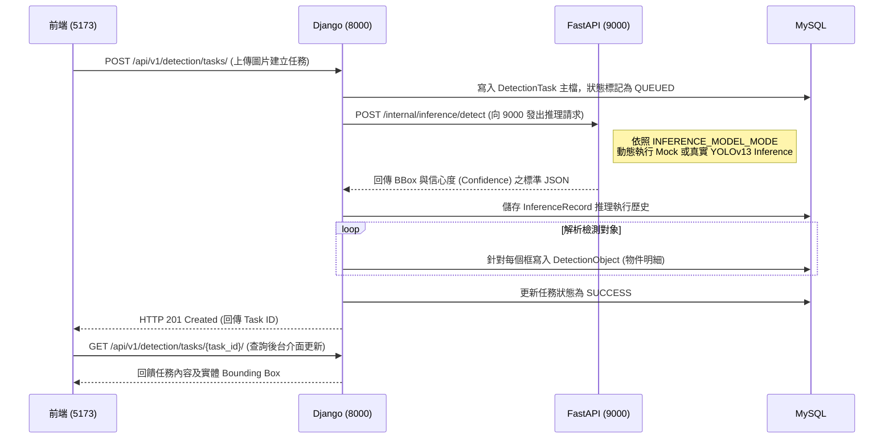

# YOLOv13 雨霧天氣目標檢測系統 - 架構與設計文檔

## 1. 系統定位與現狀
本專案為一個三層架構的全端影像辨識管理系統，專為低能見度場景設計。
**當前狀態**：前後端業務閉環與 Mock 推理已完成，真實 YOLOv13 的網路轉接卡 (Adapter) 已就緒，配合權重檔與環境變數切換即可無縫運作。異步佇列 (Celery) 為下一階段 (Phase 5) 的工程規劃。

## 2. 總體系統架構

```mermaid
flowchart TB
    Client[React 前端 / Port: 5173]
    
    subgraph "Django 業務後端 (Port: 8000)"
        API[DRF API 層]
        Auth[accounts 認證模組]
        TaskMgr[detection 任務管理]
        Dash[dashboard 統計儀表盤]
    end
    
    subgraph "推理服務 (Port: 9000)"
        FastAPI[FastAPI 路由]
        Adapter[推論 Adapter 層]
        Mock[Mock Adapter]
        Yolo[YOLOv13 Adapter]
    end
    
    DB[(MySQL 8.x)]
    Cache[(Redis)]
    Storage[本地圖片檔案庫]

    Client -->|HTTP/REST API| API
    API <--> Auth
    API <--> TaskMgr
    API <--> Dash
    
    TaskMgr -->|HTTP 同步調用 (未來將由 Celery 接手)| FastAPI
    FastAPI --> Adapter
    Adapter --> Mock
    Adapter --> Yolo
    
    TaskMgr --> DB
    Dash <--> Cache
    TaskMgr --> Storage
```

## 3. 模組責任分工與邊界

### Frontend 前端 (Port: 5173)
- **技術棧**：React 19 + Vite + Zustand + Tailwind CSS。
- **職責**：提供管理後台畫面，負責頁面路由防護、憑證 (JWT Token) 保存、呼叫業務 API、與可視化展示 (疊加模型辨識框)。
- **邊界**：絕對不直接連線至資料庫與推理端點。所有資料皆由 8000 端口對接。

### Django 業務後端 (Port: 8000)
- **技術棧**：Django 5 + DRF + MySQL + Redis。
- **職責與 Apps**：
  - `accounts`: 處理權限校驗與身份簽發。
  - `detection`: 任務生命週期管理介面，由排隊 `QUEUED` 到 `SUCCESS` 或是錯誤回滾。與底層 MySQL 完成資料持久化。
  - `dashboard`: 利用 Redis 統計任務量與辨識結果以做報表輸出。
  - `media`: 本地檔案圖片存儲封裝。
- **邊界**：負責協調流程與儲存，**不包含**任何與 AI Tensorflow/PyTorch 相關的模型讀取計算代碼。

### FastAPI 推理服務 (Port: 9000)
- **技術棧**：FastAPI + Ultralytics (YOLO)。
- **職責**：專職 CPU/GPU 密集型圖形張量運算任務。
- **邊界**：
  - 獨立進程運行，核心介面 `POST /internal/inference/detect`。
  - 核心採用 Adapter 轉接層設計，依照環境變數 `INFERENCE_MODEL_MODE` 於啟動時決定掛載 `mock.py` 或是 `yolov13.py`，向外暴露標準化之框線結果結構。

## 4. 關鍵數據流與請求時序圖



## 5. 數據庫核心實體定義
1. `DetectionTask`: 任務的起始入口點，每個圖片對應一張任務單。
2. `InferenceRecord`: 將底層 FastAPI 回傳的引擎狀態、調用名稱、模型耗時 (duration) 解耦記錄。
3. `DetectionObject`: 微觀存放每張圖辨識出的物件之絕對座標 (`bbox_x1`, `y1`, `x2`, `y2`) 與類別名 (`class_name`) 及置信度 (`confidence`)。

## 6. 待確認與後續架構優化 
- **[待確認 / 計畫中] 異步推論解耦**：當前系統中 Django 對 FastAPI 的呼叫採用**同步 HTTP 阻塞等待**。一旦 YOLO 運算時間提升或面臨高並發傳輸時，會嚴重導致 Django worker 卡死。必須在下一階段 (Phase 5) 引入 `Celery` 作為後台背景行程來實作任務隊列投遞與訂閱機制。
- **[待確認 / 未實施] 雲端存儲橋接**：目前所有使用者提交的圖片與快照皆存放於本地系統目錄 `data/uploads/`，對擴充性有所限制，後續應將 `media` APP 改良對象存儲如 Amazon S3 或本地 MinIO。
