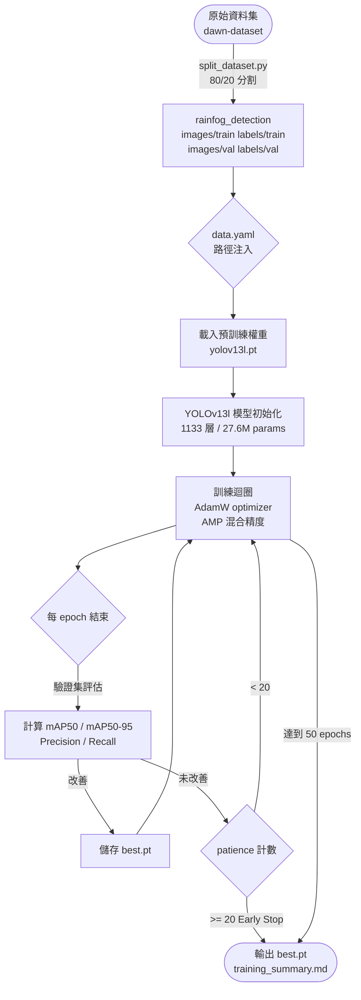
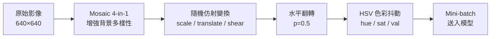
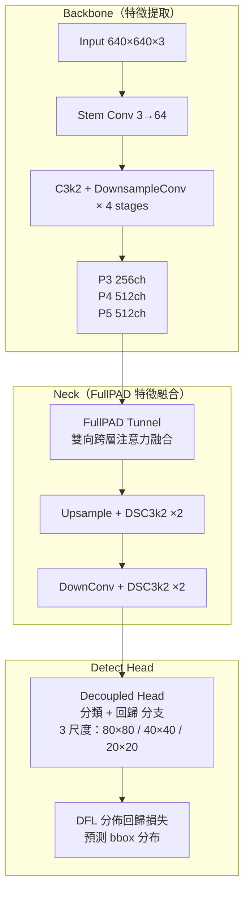

# YOLOv13 雨霧偵測微調訓練流程

## 概覽

本文件描述使用 DAWN Dataset 對 YOLOv13 進行監督式微調（Supervised Fine-Tuning）的完整流程，涵蓋資料處理、模型架構、訓練演算法及評估指標。

---

## 1. 訓練指令

```powershell
# 在 backend/ 目錄下執行
uv run python -m training.train `
  --model yolov13l.pt `
  --dataset rainfog_detection `
  --epochs 50 `
  --batch 4 `
  --imgsz 640 `
  --workers 0 `
  --patience 20 `
  --device 0
```

| 參數 | 值 | 說明 |
|------|----|------|
| `--model` | `yolov13l.pt` | 預訓練權重（Large，27.6M params） |
| `--batch` | `4` | RTX 3050 Ti 4GB VRAM 安全值 |
| `--workers` | `0` | Windows 多進程限制，避免 DataLoader 死鎖 |
| `--device` | `0` | 使用第 0 張 NVIDIA GPU |
| `--patience` | `20` | 20 epoch 無改善則提前停止 |

每次執行輸出至 `data/train_runs/rainfog_<YYYYMMDD_HHMMSS>/`，包含：
- `train.log` — 完整訓練日誌
- `weights/best.pt` — 驗證集最佳模型
- `weights/last.pt` — 最後一個 epoch 模型
- `results.csv` — 每 epoch 指標
- `training_summary.md` — 訓練摘要

---

## 2. 整體流程圖（Mermaid）



---

## 3. 資料前處理

### 3.1 資料集分割

DAWN Dataset 包含 1,027 張雨霧天氣場景影像（foggy / haze / mist / rain_storm / snow_storm / dusttornado 等），原始結構為平面目錄。`split_dataset.py` 依 80/20 比例隨機分割：

$$
N_{\text{train}} = \lfloor N \cdot 0.8 \rfloor = 822, \quad N_{\text{val}} = N - N_{\text{train}} = 205
$$

### 3.2 標注格式

每張影像對應一個 YOLO 格式標注文字檔（`.txt`），每行一個物件：

$$
\langle c \rangle \quad \langle x_c \rangle \quad \langle y_c \rangle \quad \langle w \rangle \quad \langle h \rangle
$$

其中 $c \in \{0,\ldots,5\}$ 為類別索引（truck / person / bicycle / car / motorcycle / bus），$(x_c, y_c, w, h)$ 均為相對影像尺寸的歸一化座標，$\in [0, 1]$。

### 3.3 資料增強（ultralytics 預設）



---

## 4. 模型架構

### 4.1 YOLOv13l 架構摘要



YOLOv13 相較 v8 引入 **FullPAD Tunnel**（全路徑注意力特徵融合）與 **DSC3k2**（深度可分離 C3k2），在相同參數量下顯著提升小目標偵測能力。

### 4.2 輸出解碼

對每個 anchor-free 格點 $(i, j)$，模型輸出：

$$
\hat{b} = \left[ x_c + i,\; y_c + j,\; e^{t_w} \cdot A_w,\; e^{t_h} \cdot A_h \right], \quad \hat{p} = \sigma(\mathbf{z}_{\text{cls}})
$$

最終預測分數：

$$
s = \hat{p}_c \cdot \text{IoU}(\hat{b}, b^*)
$$

---

## 5. 損失函數

總損失由三個部分組成：

$$
\mathcal{L} = \lambda_{\text{box}} \cdot \mathcal{L}_{\text{box}} + \lambda_{\text{cls}} \cdot \mathcal{L}_{\text{cls}} + \lambda_{\text{dfl}} \cdot \mathcal{L}_{\text{dfl}}
$$

### 5.1 邊界框回歸損失（CIoU）

$$
\mathcal{L}_{\text{box}} = 1 - \text{CIoU}(\hat{b}, b^*) = 1 - \text{IoU} + \frac{\rho^2(c_{\hat{b}}, c_{b^*})}{d^2} + \alpha v
$$

其中 $v = \frac{4}{\pi^2}\left(\arctan\frac{w^*}{h^*} - \arctan\frac{\hat{w}}{\hat{h}}\right)^2$，$\alpha = \frac{v}{(1 - \text{IoU}) + v}$。

### 5.2 分類損失（BCE）

$$
\mathcal{L}_{\text{cls}} = -\frac{1}{N}\sum_{i=1}^{N}\left[y_i \log \hat{p}_i + (1 - y_i)\log(1 - \hat{p}_i)\right]
$$

### 5.3 分佈焦點損失（DFL）

$$
\mathcal{L}_{\text{dfl}} = -\sum_{i} \left[(y_{i+1} - y)\log \hat{s}_i + (y - y_i)\log \hat{s}_{i+1}\right]
$$

---

## 6. 優化器與學習率排程

| 項目 | 值 |
|------|----|
| Optimizer | AdamW |
| 初始 lr | 0.001 |
| momentum | 0.9 |
| weight decay | 0.0005 |
| 排程 | Cosine Annealing + Warmup（前 3 epochs） |

$$
\eta_t = \eta_{\min} + \frac{1}{2}(\eta_{\max} - \eta_{\min})\left(1 + \cos\frac{t \cdot \pi}{T}\right)
$$

---

## 7. 評估指標

### 7.1 mAP 計算

$$
\text{AP}_c = \int_0^1 p(r)\, dr \approx \sum_{k=1}^{N} p(k) \cdot \Delta r(k)
$$

$$
\text{mAP50} = \frac{1}{C}\sum_{c=1}^{C} \text{AP}_c^{\text{IoU}=0.5}, \quad
\text{mAP50-95} = \frac{1}{10C}\sum_{t \in \{0.5,0.55,\ldots,0.95\}} \sum_{c=1}^{C} \text{AP}_c^t
$$

### 7.2 Epoch 1 驗證結果（參考）

| 指標 | 值 |
|------|----|
| Precision | 0.485 |
| Recall | 0.473 |
| mAP50 | 0.445 |
| mAP50-95 | 0.246 |

---

## 8. 訓練完成後啟用推理服務

訓練完成後，將 `best.pt` 複製並設定環境變數：

```bash
cp data/train_runs/<run_name>/weights/best.pt data/models/yolov13l_rainfog_best.pt
```

在 `backend/.env` 修改：

```env
INFERENCE_MODEL_MODE=yolov13
INFERENCE_YOLOV13_MODEL_FILE=yolov13l_rainfog_best.pt
```

---

## 9. 環境建置快速指南

```powershell
# 後端（在 backend/ 下）
uv sync --extra yolo
uv pip install --force-reinstall torch==2.5.1+cu124 torchvision==0.20.1+cu124 --index-url https://download.pytorch.org/whl/cu124

# 前端（在 frontend/ 下，需先安裝 Node.js >= 18）
npm install
```
