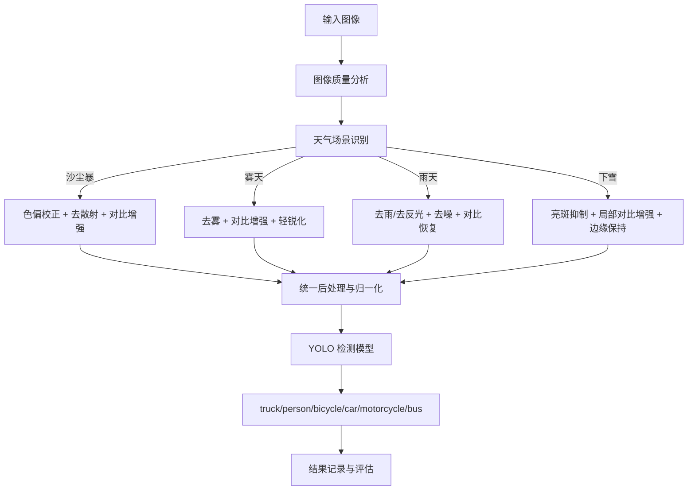
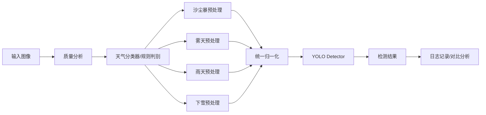
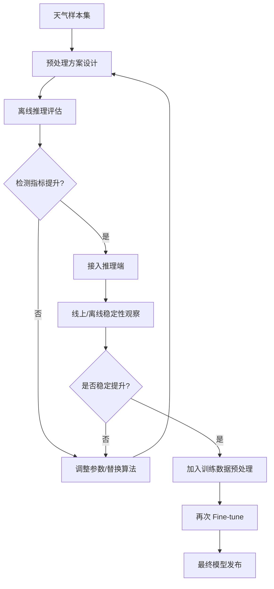

# 《面向沙尘暴 / 雾天 / 雨天 / 下雪场景的多类别目标检测图像预处理方案开发文档》

---

[toc]

---

## 0. 文档说明与假设前提

### 0.1 任务背景

当前项目已经完成基于 YOLO 系列检测模型的微调，现阶段的主要发力点转向 **图像预处理**，目标是在恶劣天气条件下提升以下类别的检测效果：

- `truck`
- `person`
- `bicycle`
- `car`
- `motorcycle`
- `bus`

### 0.2 预处理目标

本方案聚焦以下四类场景：

- **沙尘暴**
- **雾天**
- **雨天**
- **下雪**

目标不是做“图像变好看”，而是做 **检测友好的图像增强**，即：

1. 提升目标边缘和纹理可见性
2. 改善局部/全局对比度
3. 抑制天气噪声、反射和伪影
4. 尽量不破坏原始几何结构
5. 与现有 YOLO 检测模型形成稳定联动

### 0.3 核心原则

本方案采用以下原则：

- **不是所有图像统一做同一套预处理**
- **按场景类型进行自适应分流**
- **先轻量预处理，后专项增强**
- **先推理端验证，再决定是否回灌训练**
- **以检测指标提升为唯一有效标准，不以视觉观感为最终标准**

------

# 1. 场景退化分析与类别敏感性

## 1.1 四类天气的主要退化机理

| 场景   | 主要退化                                            | 对检测的影响                                                 |
| ------ | --------------------------------------------------- | ------------------------------------------------------------ |
| 沙尘暴 | 偏黄色/棕色颜色偏移、低对比、颗粒噪声、远处目标淹没 | `person/bicycle/motorcycle` 易漏检，`car/truck/bus` 远距轮廓变弱 |
| 雾天   | 全局低对比、远距离衰减、边缘模糊                    | 小目标、远目标召回显著下降                                   |
| 雨天   | 雨丝干扰、局部模糊、低照、湿地反光、车灯眩光        | 误检与漏检并存，夜雨尤其明显                                 |
| 下雪   | 雪片遮挡、白色高亮散点、轮廓断裂、地面背景变白      | `person/bicycle/motorcycle` 与背景混淆，轮廓丢失             |

------

## 1.2 不同类别对预处理的敏感性

| 类别       | 尺度特征                   | 最敏感问题                   | 预处理重点                   |
| ---------- | -------------------------- | ---------------------------- | ---------------------------- |
| person     | 中小目标为主，细长结构     | 雾天远距漏检、雨雪遮挡、低照 | 对比增强、轻锐化、局部恢复   |
| bicycle    | 细结构多、边缘脆弱         | 雾、雨、雪导致轮廓断裂       | 边缘保持、去雾、去雨、轻锐化 |
| motorcycle | 中小目标、形态复杂         | 沙尘和雾中细节丢失           | 对比增强、去雾、色偏校正     |
| car        | 中等目标、纹理适中         | 反光、低对比、局部遮挡       | 抑制高亮、提升边界稳定性     |
| truck      | 大目标为主，但远距也会退化 | 雾天远距边缘弱、沙尘偏色     | 去雾、色彩恢复、轻对比增强   |
| bus        | 大目标但常伴反光/遮挡      | 雨夜反光、雾天边界弱         | 高亮抑制、局部对比增强       |

------

# 2. 总体预处理方案设计

## 2.1 推荐总体架构

推荐采用 **“场景识别 + 场景专属预处理 + 检测推理”** 三段式架构，而不是单一固定预处理。

### 总体流程概述

1. 输入图像
2. 进行轻量质量分析与场景判别
3. 按沙尘暴 / 雾天 / 雨天 / 下雪进行分流
4. 应用对应预处理算法组合
5. 输出给 YOLO 检测器
6. 记录预处理类型与检测结果，便于回溯

------

## 2.2 项目总流程图



------

# 3. 分场景图像预处理方案

------

# 3.1 沙尘暴场景预处理方案

## 3.1.1 场景特点

沙尘暴通常会带来：

- 明显黄褐色偏色
- 整体对比度下降
- 局部颗粒噪声
- 远处目标轮廓模糊
- 颜色信息污染严重

对于检测来说，最大问题不是雨丝那种局部遮挡，而是 **整体成像质量下降 + 颜色偏移 + 远景消失**。

------

## 3.1.2 推荐处理链路

推荐顺序：

1. **颜色偏移校正**
2. **去散射 / 去霾**
3. **局部对比增强**
4. **轻量去噪**
5. **必要时轻锐化**

------

## 3.1.3 推荐算法

### A. White Balance / Gray World 色彩校正

用于纠正沙尘暴引起的黄棕偏色。

**优点**

- 简单
- 速度快
- 对后续去雾更友好

**推荐**

- 第一阶段必做

------

### B. DCP 类去雾 / 去散射

沙尘暴与雾天都存在散射问题，因此可以借鉴去雾思路。

**推荐方法**

- 暗通道先验（DCP）
- 导向滤波优化透射率图

**作用**

- 拉开远处目标和背景的对比
- 恢复轮廓信息

------

### C. CLAHE 局部对比增强

在 LAB 或 HSV 亮度通道上处理。

**作用**

- 提升边缘可见性
- 对 `person/bicycle/motorcycle` 有明显帮助

------

### D. Bilateral / Guided Filter

用于抑制颗粒噪声，同时保护边界。

------

## 3.1.4 沙尘暴推荐配置

推荐组合：

- `Gray World White Balance`
- `DCP Dehaze`
- `CLAHE on L channel`
- `Guided Filter`

### 工程优先级

**高优先级**

------

# 3.2 雾天场景预处理方案

## 3.2.1 场景特点

雾天对检测的影响最典型：

- 全局低对比
- 远距离目标严重退化
- 边缘模糊
- 小目标直接消失

`person/bicycle/motorcycle` 在雾天是最脆弱的几类。

------

## 3.2.2 推荐处理链路

推荐顺序：

1. **去雾**
2. **亮度/对比增强**
3. **边缘轻增强**
4. **避免过强锐化**

------

## 3.2.3 推荐算法

### A. 暗通道先验去雾（DCP）

适合作为传统基线。

**优点**

- 成熟
- 可解释
- 对中重度雾有效

**缺点**

- 天空区域可能失真
- 参数需要调节

------

### B. CLAHE

适合轻雾和普遍低对比图像。

**作用**

- 提升局部对比度
- 对远距离车辆边界恢复有帮助

------

### C. Retinex

适合雾和低照叠加场景，尤其在清晨/黄昏。

**推荐**

- 作为备选，不做首轮主方案

------

### D. 轻锐化（Unsharp Mask）

适合在去雾后做轻量边缘恢复。

**注意**

- 不能过强，否则会引入伪边缘
- 只推荐低强度使用

------

## 3.2.4 雾天推荐配置

推荐组合：

- `DCP`
- `CLAHE`
- `Mild Unsharp Mask`

或轻量方案：

- `CLAHE`
- `Gamma微调`
- `Mild Unsharp Mask`

### 工程优先级

**最高优先级之一**

------

# 3.3 雨天场景预处理方案

## 3.3.1 场景特点

雨天问题比较复杂，可能包含：

- 雨丝干扰
- 局部模糊
- 低照度
- 湿地反射
- 车灯眩光
- 镜头水滴

其中最难的是 **雨夜**，因为既有低照又有强反光。

------

## 3.3.2 推荐处理链路

推荐顺序：

1. **去噪 / 保边滤波**
2. **适度去雨**
3. **亮度与对比恢复**
4. **高亮抑制**
5. **必要时轻锐化**

------

## 3.3.3 推荐算法

### A. Bilateral Filter

适合作为雨天轻量基线。

**作用**

- 去掉部分噪声
- 保持边缘
- 对后续增强友好

------

### B. Guided Filter

与 bilateral 类似，但更平滑、更适合作为辅助模块。

------

### C. 单帧去雨网络 / 传统去雨算法

如果你的雨丝特别明显，建议做专项实验。

**注意**

- 不建议一开始全量接入
- 先小样本验证是否真的提升检测

------

### D. CLAHE / Gamma

用于恢复低照度和低对比。

------

### E. 高亮抑制 / Tone Mapping

对夜雨场景非常重要。

**作用**

- 缓解车灯、路灯、湿路反射引发的误检
- 降低过曝区域对检测器的污染

------

## 3.3.4 雨天推荐配置

白天雨天推荐：

- `Bilateral Filter`
- `CLAHE`

夜间雨天推荐：

- `Bilateral Filter`
- `Tone Mapping`
- `CLAHE`
- `可选 Gamma`

### 工程优先级

**非常高**

------

# 3.4 下雪场景预处理方案

## 3.4.1 场景特点

雪天的挑战包括：

- 雪片随机遮挡
- 白色背景导致对比下降
- 亮斑过多
- 小目标边缘断裂

对于 `person/bicycle/motorcycle` 影响尤其大。

------

## 3.4.2 推荐处理链路

推荐顺序：

1. **局部亮斑抑制**
2. **局部对比增强**
3. **保边去噪**
4. **轻锐化**

------

## 3.4.3 推荐算法

### A. CLAHE

对雪天很有用，尤其在 L 通道处理时。

### B. Bilateral / Guided Filter

减少雪点干扰，保护边缘。

### C. 高亮压缩

对于大面积白色雪景和反射区域有帮助。

### D. 轻锐化

恢复断裂轮廓，但不能太强。

------

## 3.4.4 下雪推荐配置

推荐组合：

- `Highlight Compression`
- `CLAHE`
- `Bilateral Filter`
- `Mild Unsharp Mask`

### 工程优先级

**高**

------

# 4. 场景-算法映射总表

| 场景   | 核心问题                     | 推荐主算法                   | 推荐辅算法           | 是否高优先级 |
| ------ | ---------------------------- | ---------------------------- | -------------------- | ------------ |
| 沙尘暴 | 偏色、低对比、远处目标淹没   | White Balance、DCP           | CLAHE、Guided Filter | 高           |
| 雾天   | 去对比、远景模糊             | DCP                          | CLAHE、Unsharp       | 最高         |
| 雨天   | 雨丝、低照、反光             | Bilateral、Tone Mapping      | CLAHE、Guided Filter | 最高         |
| 下雪   | 白色散点、轮廓断裂、背景变亮 | CLAHE、Highlight Compression | Bilateral、Unsharp   | 高           |

------

# 5. 推荐实施策略

## 5.1 不建议固定单一预处理

不要所有图都用同一条处理链。
推荐做成 **场景自适应预处理策略**：

### 推荐策略

- 沙尘暴：`WB + DCP + CLAHE`
- 雾天：`DCP + CLAHE + Mild Unsharp`
- 雨天：`Bilateral + Tone Mapping + CLAHE`
- 下雪：`Highlight Compression + CLAHE + Bilateral`

------

## 5.2 先推理端接入，再训练端联动

### 阶段 1

只在推理端做预处理对比实验。

### 阶段 2

确定最优预处理后，再把对应预处理同步加入训练数据 pipeline，重新 fine-tune 一轮。

### 原因

如果只在推理时预处理，而训练时模型没见过这种分布，提升可能有限甚至不稳定。

------

# 6. 模块化系统设计

## 6.1 模块划分

1. **图像质量分析模块**
2. **天气场景识别模块**
3. **场景专属预处理模块**
4. **统一归一化模块**
5. **检测推理模块**
6. **日志与评估模块**

------

## 6.2 模块关系图



------

# 7. 预处理模块详细设计

## 7.1 沙尘暴预处理模块

### 输入

RGB 图像

### 输出

颜色校正且对比增强后的 RGB 图像

### 处理步骤

1. 白平衡
2. DCP 去散射
3. CLAHE
4. Guided Filter

------

## 7.2 雾天预处理模块

### 输入

RGB 图像

### 输出

去雾且增强边缘的 RGB 图像

### 处理步骤

1. DCP 去雾
2. CLAHE
3. 轻锐化

------

## 7.3 雨天预处理模块

### 输入

RGB 图像

### 输出

抑制雨噪和反光后的 RGB 图像

### 处理步骤

1. Bilateral Filter
2. Tone Mapping
3. CLAHE
4. 可选 Gamma

------

## 7.4 下雪预处理模块

### 输入

RGB 图像

### 输出

抑制亮斑并恢复局部轮廓后的 RGB 图像

### 处理步骤

1. Highlight Compression
2. CLAHE
3. Bilateral Filter
4. 轻锐化

------

# 8. Python 风格伪代码

------

## 8.1 总体预处理调度流程

说明：按场景类型调用不同预处理模块。

```python
def preprocess_dispatch(image, scene_type, cfg):
    """
    根据场景类型选择对应预处理链路
    scene_type: ['sandstorm', 'fog', 'rain', 'snow']
    """
    if scene_type == "sandstorm":
        image = preprocess_sandstorm(image, cfg.sandstorm)
    elif scene_type == "fog":
        image = preprocess_fog(image, cfg.fog)
    elif scene_type == "rain":
        image = preprocess_rain(image, cfg.rain)
    elif scene_type == "snow":
        image = preprocess_snow(image, cfg.snow)
    else:
        image = preprocess_default(image, cfg.default)

    image = normalize_for_detector(image, cfg.detector_input)
    return image
```

------

## 8.2 沙尘暴预处理伪代码

说明：先纠正偏色，再恢复对比，最后做平滑与保边。

```python
def preprocess_sandstorm(image, cfg):
    """
    沙尘暴场景:
    1. 白平衡校正
    2. 去散射/去霾
    3. 局部对比增强
    4. 导向滤波保边去噪
    """
    image = white_balance_gray_world(image, strength=cfg.wb_strength)
    image = dehaze_dcp(image,
                       omega=cfg.dcp_omega,
                       t_min=cfg.dcp_t_min,
                       guided_radius=cfg.guided_radius)
    image = clahe_on_l_channel(image,
                               clip_limit=cfg.clahe_clip_limit,
                               tile_grid_size=cfg.clahe_tile_grid)
    image = guided_filter_smooth(image,
                                 radius=cfg.guided_radius,
                                 eps=cfg.guided_eps)
    return image
```

------

## 8.3 雾天预处理伪代码

说明：核心是去雾和恢复边界，但锐化不能过强。

```python
def preprocess_fog(image, cfg):
    """
    雾天场景:
    1. DCP 去雾
    2. CLAHE 增强局部对比
    3. 轻度锐化
    """
    image = dehaze_dcp(image,
                       omega=cfg.dcp_omega,
                       t_min=cfg.dcp_t_min,
                       guided_radius=cfg.guided_radius)
    image = clahe_on_l_channel(image,
                               clip_limit=cfg.clahe_clip_limit,
                               tile_grid_size=cfg.clahe_tile_grid)
    image = unsharp_mask(image,
                         sigma=cfg.unsharp_sigma,
                         amount=cfg.unsharp_amount,
                         threshold=cfg.unsharp_threshold)
    return image
```

------

## 8.4 雨天预处理伪代码

说明：雨天重点在于保边去噪、反光抑制和低照恢复。

```python
def preprocess_rain(image, cfg):
    """
    雨天场景:
    1. 双边滤波保边去噪
    2. 高亮压缩/色调映射
    3. CLAHE 提升局部对比
    4. 可选 gamma 调整
    """
    image = bilateral_filter(image,
                             d=cfg.bilateral_d,
                             sigma_color=cfg.bilateral_sigma_color,
                             sigma_space=cfg.bilateral_sigma_space)
    image = tone_mapping(image,
                         gamma=cfg.tone_gamma,
                         saturation=cfg.tone_saturation)
    image = clahe_on_l_channel(image,
                               clip_limit=cfg.clahe_clip_limit,
                               tile_grid_size=cfg.clahe_tile_grid)

    if cfg.enable_gamma:
        image = gamma_correction(image, gamma=cfg.gamma_value)

    return image
```

------

## 8.5 下雪预处理伪代码

说明：雪天不建议做强去雨类算法，重点是亮斑压制和边缘恢复。

```python
def preprocess_snow(image, cfg):
    """
    下雪场景:
    1. 高亮区域压缩
    2. CLAHE 增强局部结构
    3. 双边滤波去除部分雪点
    4. 轻度锐化恢复轮廓
    """
    image = highlight_compression(image,
                                  strength=cfg.highlight_strength)
    image = clahe_on_l_channel(image,
                               clip_limit=cfg.clahe_clip_limit,
                               tile_grid_size=cfg.clahe_tile_grid)
    image = bilateral_filter(image,
                             d=cfg.bilateral_d,
                             sigma_color=cfg.bilateral_sigma_color,
                             sigma_space=cfg.bilateral_sigma_space)
    image = unsharp_mask(image,
                         sigma=cfg.unsharp_sigma,
                         amount=cfg.unsharp_amount,
                         threshold=cfg.unsharp_threshold)
    return image
```

------

## 8.6 整体推理流程伪代码

说明：把场景识别、预处理和检测串起来。

```python
def inference_pipeline(image, detector, scene_classifier, cfg):
    """
    完整推理流程:
    1. 场景识别
    2. 预处理分流
    3. 检测推理
    4. 记录日志
    """
    scene_type = scene_classifier.predict(image)

    processed = preprocess_dispatch(
        image=image,
        scene_type=scene_type,
        cfg=cfg.preprocess
    )

    detections = detector.predict(
        processed,
        conf_thres=cfg.detector.conf_thres,
        iou_thres=cfg.detector.iou_thres
    )

    log_result({
        "scene_type": scene_type,
        "num_boxes": len(detections),
        "classes": [det.cls_name for det in detections]
    })

    return detections
```

------

## 8.7 预处理实验评估流程伪代码

说明：用于比较不同预处理方案对检测效果的影响。

```python
def evaluate_preprocess_schemes(dataset, detector, schemes, evaluator):
    """
    对多个预处理方案进行离线评估
    输出:
      - overall mAP
      - per-weather recall
      - per-class AP
    """
    all_reports = []

    for scheme_name, preprocess_fn in schemes.items():
        predictions = []

        for sample in dataset:
            image = read_image(sample.image_path)
            processed = preprocess_fn(image)
            dets = detector.predict(processed)
            predictions.append({
                "image_id": sample.image_id,
                "detections": dets,
                "weather": sample.weather,
                "gt": sample.gt
            })

        report = evaluator.compute(predictions)
        report["scheme_name"] = scheme_name
        all_reports.append(report)

    return all_reports
```

------

# 9. 预处理实验设计建议

## 9.1 推荐的实验分组

建议先做以下实验组：

| 实验名    | 场景   | 预处理方案                                |
| --------- | ------ | ----------------------------------------- |
| baseline  | 全部   | 不处理                                    |
| sand_v1   | 沙尘暴 | WB + DCP + CLAHE                          |
| fog_v1    | 雾天   | DCP + CLAHE + Unsharp                     |
| rain_v1   | 雨天   | Bilateral + Tone Mapping + CLAHE          |
| snow_v1   | 下雪   | Highlight Compression + CLAHE + Bilateral |
| hybrid_v1 | 全部   | 按天气自适应分流                          |

------

## 9.2 重点评估指标

除了总体 mAP，还必须看：

### 按天气分组

- Sandstorm Recall
- Fog Recall
- Rain Recall
- Snow Recall

### 按类别分组

- AP_person
- AP_bicycle
- AP_motorcycle
- AP_car
- AP_truck
- AP_bus

### 特别关注

- `person / bicycle / motorcycle` 的 Recall 改善
- 远距离 `car / truck / bus` 的漏检率变化
- 雨夜反光下的误检率变化

------

# 10. 预处理回灌训练策略

## 10.1 推荐路线

### 第一阶段

只在推理端做预处理，验证收益。

### 第二阶段

将收益稳定的方案加入训练 pipeline：

- 对对应天气样本进行相同预处理
- 再做一轮 fine-tune

### 第三阶段

比较：

- 原模型 + 原图
- 原模型 + 预处理图
- 重新训练模型 + 预处理图

最终选择最稳定版本。

------

## 10.2 闭环优化图



------

# 11. 推荐项目目录结构（Python）

```text
preprocess_weather_project/
├── configs/
│   ├── preprocess.yaml
│   ├── detector.yaml
│   └── experiment.yaml
├── src/
│   ├── scene/
│   │   ├── classifier.py
│   │   └── quality_analyzer.py
│   ├── preprocess/
│   │   ├── base.py
│   │   ├── sandstorm.py
│   │   ├── fog.py
│   │   ├── rain.py
│   │   ├── snow.py
│   │   └── utils.py
│   ├── detector/
│   │   └── infer.py
│   ├── evaluation/
│   │   ├── metrics.py
│   │   ├── compare.py
│   │   └── weather_report.py
│   └── pipeline/
│       ├── preprocess_dispatch.py
│       └── inference_pipeline.py
├── scripts/
│   ├── run_eval.py
│   ├── run_infer.py
│   └── export_reports.py
├── experiments/
│   ├── exp_baseline/
│   ├── exp_fog/
│   ├── exp_rain/
│   ├── exp_snow/
│   └── exp_sandstorm/
└── docs/
    └── preprocess_design.md
```

------

# 12. 参数建议（起步版）

下面给你一版适合起步实验的参数建议。

## CLAHE

- `clip_limit`: 2.0 ~ 4.0
- `tile_grid_size`: (8, 8)

## DCP

- `omega`: 0.90 ~ 0.95
- `t_min`: 0.10 ~ 0.20
- `guided_radius`: 20 ~ 40

## Bilateral Filter

- `d`: 5 ~ 9
- `sigma_color`: 30 ~ 80
- `sigma_space`: 30 ~ 80

## Unsharp Mask

- `sigma`: 1.0 ~ 2.0
- `amount`: 0.8 ~ 1.5
- `threshold`: 3 ~ 10

## Gamma

- 夜间偏暗：`1.2 ~ 1.8`
- 亮度已足够时不要启用

## Highlight Compression

- 建议做成可调强度：`0.2 ~ 0.6`

------

# 13. 最终推荐方案

## 13.1 最务实的首版方案

如果你现在想快速落地，不想一次铺太大，我建议你先做下面这四条：

### 沙尘暴

```
White Balance + DCP + CLAHE
```

### 雾天

```
DCP + CLAHE + Mild Unsharp
```

### 雨天

```
Bilateral + Tone Mapping + CLAHE
```

### 下雪

```
Highlight Compression + CLAHE + Bilateral
```

------

## 13.2 优先级排序

### 第一优先级

- 雾天：`DCP + CLAHE`
- 雨天：`Bilateral + Tone Mapping + CLAHE`

### 第二优先级

- 沙尘暴：`White Balance + DCP + CLAHE`
- 下雪：`Highlight Compression + CLAHE`

### 第三优先级

- 将最优预处理方案回灌训练，再次 fine-tune

------

## 13.3 一句话总结

你的预处理方案不应该是“做一套万能增强”，而应该是：

> **按沙尘暴 / 雾天 / 雨天 / 下雪分场景建立专属预处理链路，再与 YOLO 检测闭环优化。**

这样最符合你现在“模型已经 fine-tune，当前发力点是图像预处理”的阶段目标。

如果你要，我下一步可以直接继续给你补一份 **OpenCV/Python 可运行版代码框架**，把上面这四个天气预处理模块都写成函数模板。